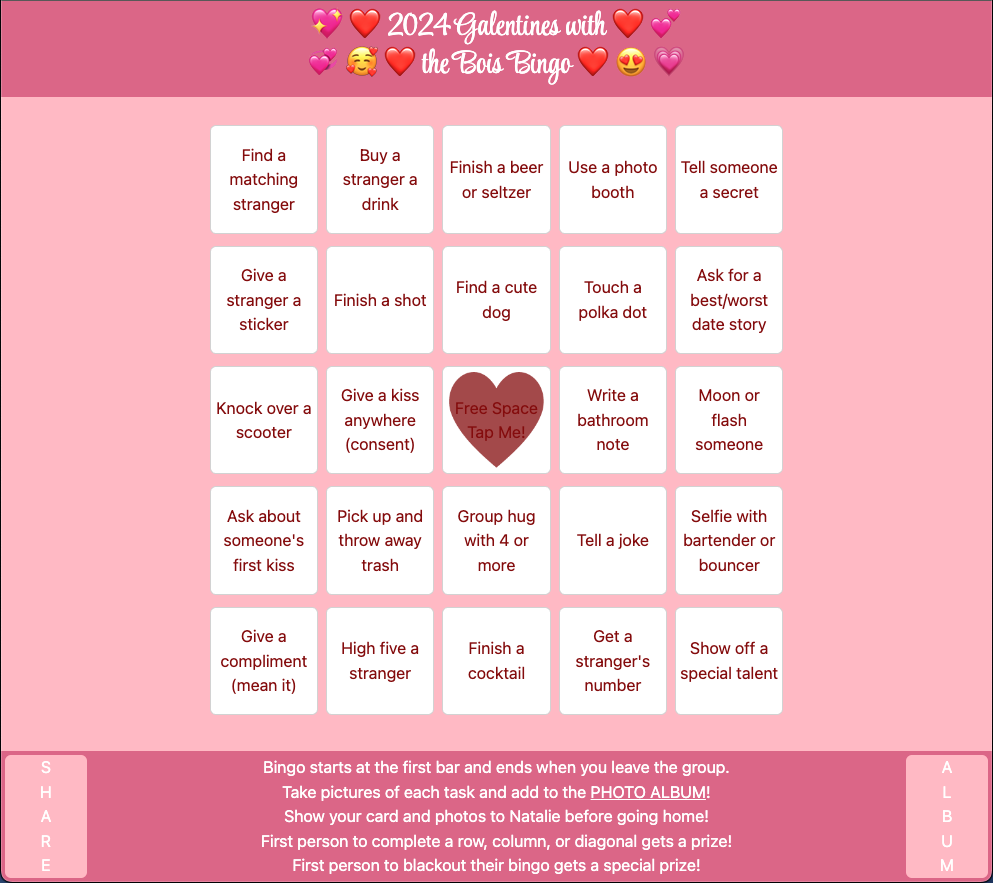

# Bingo

A fun interactive bingo sheet that saves status of each card to localStorage. Can easily be adapted and changed for different events. This one is for Natalie Beckers bar crawl.

## Description

Using Bootstrap CSS and some localStorage and toggle jQuery functions I created a 5 by 5 grid of togglable cards with tasks on them. Here is a screenshot of my completed work as of 2.2.2024.

## Installation

No installation necessary. You only need internet access, and to click this link: https://jessedenier.github.io/Bingo/

## Usage

This webpage can be opened and interacted with immediately. Every white square can be clicked or tapped to display a transparent heart over it to signify completion. Additionally the "share" and "album" buttons at the bottom can be clicked to open a QR code or a photo album respectively.

## Credits

All credit for code goes to myself, Jesse Denier. Natalie Becker provided useful corrections and suggestions for stylistic decisions.

## License

Copyright (c) 2012-2023 Scott Chacon and others

Permission is hereby granted, free of charge, to any person obtaining
a copy of this software and associated documentation files (the
"Software"), to deal in the Software without restriction, including
without limitation the rights to use, copy, modify, merge, publish,
distribute, sublicense, and/or sell copies of the Software, and to
permit persons to whom the Software is furnished to do so, subject to
the following conditions:

The above copyright notice and this permission notice shall be
included in all copies or substantial portions of the Software.

THE SOFTWARE IS PROVIDED "AS IS", WITHOUT WARRANTY OF ANY KIND,
EXPRESS OR IMPLIED, INCLUDING BUT NOT LIMITED TO THE WARRANTIES OF
MERCHANTABILITY, FITNESS FOR A PARTICULAR PURPOSE AND
NONINFRINGEMENT. IN NO EVENT SHALL THE AUTHORS OR COPYRIGHT HOLDERS BE
LIABLE FOR ANY CLAIM, DAMAGES OR OTHER LIABILITY, WHETHER IN AN ACTION
OF CONTRACT, TORT OR OTHERWISE, ARISING FROM, OUT OF OR IN CONNECTION
WITH THE SOFTWARE OR THE USE OR OTHER DEALINGS IN THE SOFTWARE.
